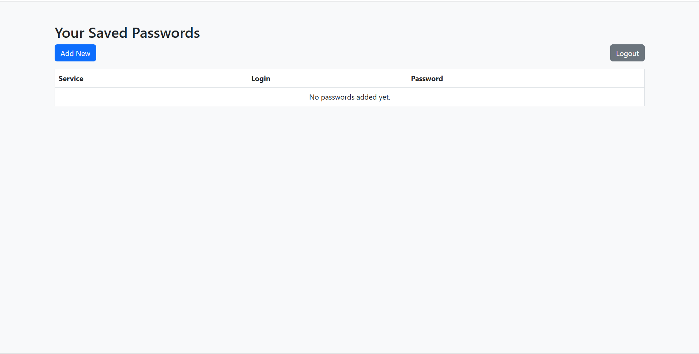

# Password Manager

## Overview

Password Manager is a secure and user-friendly application designed to help individuals store and manage their passwords efficiently. Built with Flask, it offers encryption features to ensure that users' credentials are protected.

## Features

- **Master Password Authentication**: Users authenticate using a master password to access their stored credentials.
- **Password Storage**: Securely store usernames and passwords for various services.
- **Password Generation**: Generate strong, customizable passwords with options to adjust length and include symbols, numbers, or special characters.
- **User Management**: Add, view, update, and delete stored credentials.
- **Encryption**: All stored passwords are encrypted using the `cryptography` library to ensure data security.

## Screenshots



*User Dashboard*

## Installation

1. **Clone the Repository**:
   ```bash
   git clone https://github.com/chikochikomba/Password-Manager.git
