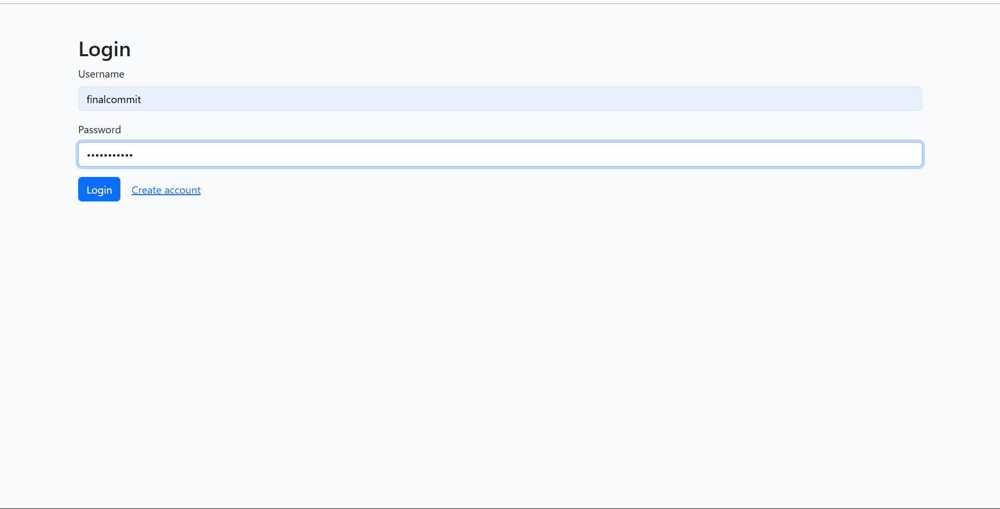

# Password Manager

## Overview

Password Manager is a secure and user-friendly application designed to help individuals store and manage their passwords efficiently. Built with Flask, it offers encryption features to ensure that users' credentials are protected.

## Features

- **Master Password Authentication**: Users authenticate using a master password to access their stored credentials.
- **Password Storage**: Securely store usernames and passwords for various services.
- **Password Generation**: Generate strong, customizable passwords with options to adjust length and include symbols, numbers, or special characters.
- **User Management**: Add, view, update, and delete stored credentials.
- **Encryption**: All stored passwords are encrypted using the `cryptography` library to ensure data security.

## Screenshots




## Installation

1. **Clone the Repository**:
   ```bash
   git clone https://github.com/your-username/Password-Manager.git

2. **Navigate to the project directory**: cd password-manager

3. **Install Dependencies** : pip isntall -r requirements.txt

4. **Set Up the Database**: Initialize the SQLite database:
   *bash*
   flask db init
   flask db migrate -m "Initial migration."
   flask db upgrade
   
--Usage--

**Access the Application**: *Open your web browser and navigate to http://127.0.0.1:5000*

**Authenticate**: *Enter your master password to access the dashboard*.

**Manage Passwords**:

**Add New Credentials**: *Use the "Add Password" feature to store new credentials*.

Generate Passwords: *Utilize the password generator to create strong passwords tailored to your preferences.*

View Stored Credentials: *Access and manage your stored usernames and passwords from the dashboard*
